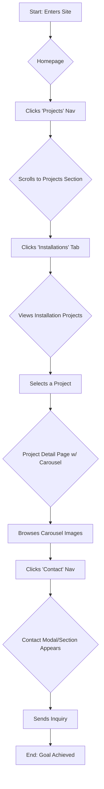

# maja-explosiv UX/UI Specification

_Generated on 2025-10-23 by Michael_

## Executive Summary

The Maja Explosiv Website Redesign project aims to replace an outdated and insecure TYPO3-based portfolio website with a modern, performant, and secure static site built with Eleventy. The primary goals are to ensure business continuity, improve content management for the artist through a Git-based workflow, and achieve high performance (Google PageSpeed score of 90+).

The project is currently in the "Solutioning" phase. Key features to be implemented include a complete migration of existing content and assets, a high-fidelity desktop UI based on Figma mockups, an interactive image carousel, and a news feed. The target users are gallery curators and the artist herself, who will manage the site's content. The initial launch is focused on the desktop experience, with mobile design and other features scoped out for future phases.

---

## 1. UX Goals and Principles

### 1.1 Target User Personas

### 1.1 Target User Personas

| Type      | Persona         | Role & Goals                                       |
| :-------- | :-------------- | :------------------------------------------------- |
| **Primary**   | Gallery Curator | Evaluates artwork for potential exhibitions.       |
| **Secondary** | The Artist      | Manages and updates the portfolio content.         |

### 1.2 Usability Goals

- **Ease of Learning:** The artist must be able to manage content with minimal training.
- **Efficiency:** Curators should be able to find and evaluate artwork quickly.
- **Error Prevention:** The content workflow should minimize the risk of mistakes.
- **Accessibility:** The site must comply with WCAG standards.

### 1.3 Design Principles

- **Clarity and Focus:** The design must prioritize showcasing the artwork without distraction.
- **Modern & Professional:** The aesthetic should be clean, contemporary, and reflect the high quality of the artist's work.
- **Intuitive Navigation:** Users should be able to easily find their way around the site and discover new content with a minimal number of clicks.
- **Performant:** The site must load quickly to provide a seamless and engaging experience.

---

## 2. Information Architecture

### 2.1 Site Map

The website will be structured as a Single Page Application (SPA) with the following hierarchy:

- **Homepage (`/`)**
    - **Top Section** (Featured Content)
    - **Projects Section**
        - Sculptures (Tab)
        - Installations (Tab)
        - Performance (Tab)
        - Paintings (Tab)
    - **About Section**
        - Bio (Tab)
        - Press (Tab)
        - Links (Tab)
    - **Contact** (Accessed via Navigation, likely a modal or dedicated homepage section)

### 2.2 Navigation Structure

- **Primary Navigation (Vertical - Left Side):** A persistent vertical navigation bar will be present on the left side of the screen, providing global access to all main sections and their sub-categories.
    - **Projects**
        - Sculptures
        - Installations
        - Performance
        - Paintings
    - **About**
        - Bio
        - Press
        - Links
    - **Contact**
- **Secondary Navigation (In-page Tabs):** To reinforce context and provide clear local navigation, tab-like links will appear at the top of their respective content sections.
    - **Projects Section Tabs:** `Sculptures`, `Installations`, `Performance`, `Paintings`
    - **About Section Tabs:** `Bio`, `Press`, `Links`
- **Mobile Navigation:** Out of scope for the initial release.
- **Breadcrumbs:** Will not be implemented in this phase.

---

## 3. User Flows

### Flow 1: Gallery Curator Explores and Inquires About Work

- **User Goal:** To evaluate the artist's work and inquire about a specific series for an upcoming exhibition.
- **Entry Point:** Direct link to the website from an external source (e.g., newsletter, social media).

**Step-by-Step Flow:**

1.  User lands on the homepage and sees the main featured content.
2.  User clicks on "Projects" in the left-hand vertical navigation.
3.  The page view smoothly scrolls to the "Projects" section.
4.  User clicks on a specific category tab, for example, "Installations".
5.  The content area updates to show a gallery of installation projects.
6.  User clicks on a specific project to view its details.
7.  The view transitions to a detailed display of the project, including an image carousel.
8.  User interacts with the carousel to browse through all images in the series.
9.  Impressed, the user clicks "Contact" in the left-hand navigation.
10. A contact modal window appears, or the view scrolls to a contact section on the page.
11. User notes the contact information or fills out the contact form (functionality deferred).

**Success Criteria:**
- The curator is able to navigate from the homepage to a specific project and view all its images.
- The curator can easily find and access the artist's contact information.

**Error States & Edge Cases:**
- **No Projects in Category:** If a category tab is selected but contains no projects, a message like "More works coming soon" should be displayed.
- **Image Loading Failure:** If an image in the carousel fails to load, a placeholder graphic and/or an error icon should be displayed.

**Mermaid Diagram:**

{{user_flow_2}}

{{user_flow_3}}

{{user_flow_4}}

{{user_flow_5}}

---

## 4. Component Library and Design System

### 4.1 Design System Approach

A hybrid model will be used, combining a foundational system with custom implementation:

- **Foundation:** The project will leverage the existing design system of the upstream `explosive-11ty` template, which is built on Open Props.
- **Customization:** New components will be created with high fidelity to the provided Figma designs.
- **Development Workflow:** A clear separation of concerns will be maintained:
    - **Upstream Repo:** Core component functionality will be implemented in the `explosive-11ty` template repository.
    - **Downstream Repo (This Project):** Site-specific styling and visual adjustments will be implemented here. Changes from the upstream will be synced as needed.

### 4.2 Core Components

The following components are critical for the initial site build. States and variants for each will be defined based on the Figma designs.

- **Image Carousel:** Displays a series of images for a single project, with navigation controls.
- **News Feed:** A chronological list of news items, likely for the homepage or a dedicated section.
- **Vertical Navigation:** The primary, persistent navigation menu on the left of the screen.
- **In-page Tabs:** The secondary navigation system at the top of the Projects and About sections.
- **Project Gallery/Grid:** A visual layout for displaying multiple projects within a category.
- **Contact Modal/Section:** The UI for displaying contact information, which may be a modal window or a section on the main page.

---

## 5. Visual Design Foundation

### 5.1 Color Palette

The complete color palette, including primary, secondary, and semantic colors (for success, error, warnings), is defined in the official Figma design file.

- **Source of Truth:** [Maja Thommen_Website-Redesign on Figma](https://www.figma.com/design/18tst8uq38FlDlaZA5cPCz/Maja-Thommen_Website-Redesign)

### 5.2 Typography

All typography rules, including font families, weights, sizes, and the full type scale for headings and body text, are defined in the official Figma design file.

- **Source of Truth:** [Maja Thommen_Website-Redesign on Figma](https://www.figma.com/design/18tst8uq38FlDlaZA5cPCz/Maja-Thommen_Website-Redesign)

### 5.3 Spacing and Layout

All spacing rules, grid systems, and layout structures are defined in the official Figma design file. This includes margins, padding, and container sizes.

- **Source of Truth:** [Maja Thommen_Website-Redesign on Figma](https://www.figma.com/design/18tst8uq38FlDlaZA5cPCz/Maja-Thommen_Website-Redesign)

---

## 6. Responsive Design

### 6.1 Breakpoints

Responsive design is out of scope for the initial project phase. The design is desktop-first, and no specific breakpoints for mobile or tablet devices will be implemented at this stage.

### 6.2 Adaptation Patterns

No responsive adaptation patterns (e.g., reflowing content, changing navigation) will be developed. The layout will be fixed for a desktop viewport.

---

## 7. Accessibility

### 7.1 Compliance Target

The project will target **WCAG 2.1 Level AA** compliance.

### 7.2 Key Requirements

- **Alt Text:** All meaningful images must have descriptive alternative text.
- **Color Contrast:** Text and interactive elements must have a contrast ratio of at least 4.5:1 against their background.
- **Keyboard Navigation:** All interactive elements (links, buttons, form fields, carousel controls) must be fully operable with a keyboard.
- **Semantic HTML:** The application must use semantic HTML5 elements to define the structure of the page (e.g., `<nav>`, `<main>`, `<article>`).
- **ARIA Roles:** Appropriate ARIA (Accessible Rich Internet Applications) roles and attributes will be used to provide additional context for complex components like the tabbed sections and carousel.

---

## 8. Interaction and Motion

### 8.1 Motion Principles

Per the PRD, the definition of motion principles and animations is out of scope for the initial project phase to prioritize core functionality.

### 8.2 Key Animations

No key animations or micro-interactions will be defined or implemented in this phase.

---

## 9. Design Files and Wireframes

### 9.1 Design Files

The single source of truth for all high-fidelity designs and wireframes is the official project Figma file, which is managed by the designer.

- **Figma Link:** [Maja Thommen_Website-Redesign](https://www.figma.com/design/18tst8uq38FlDlaZA5cPCz/Maja-Thommen_Website-Redesign)

### 9.2 Key Screen Layouts

{{screen_layout_1}}

{{screen_layout_2}}

{{screen_layout_3}}

---

## 10. Next Steps

### 10.1 Immediate Actions

- **Review UX Specification:** Share this document with all stakeholders (including the designer and developer) for feedback and final approval.
- **Finalize Visual Designs:** The designer can proceed with finalizing all screens and components in Figma, using this specification as the functional guide.
- **Begin Frontend Planning:** The development team can start planning the implementation of the core components and layouts based on the defined architecture and component model.

### 10.2 Design Handoff Checklist

- [x] All user flows documented
- [x] Component inventory complete
- [x] Accessibility requirements defined
- [x] Responsive strategy clear (scoped out)
- [x] Brand guidelines incorporated (via Figma)
- [ ] Performance goals established (Google PageSpeed 90+ target from PRD)

---

## Appendix

### Related Documents

- PRD: `{{prd}}`
- Epics: `{{epics}}`
- Tech Spec: `{{tech_spec}}`
- Architecture: `{{architecture}}`

### Version History

| Date     | Version | Changes               | Author        |
| -------- | ------- | --------------------- | ------------- |
| 2025-10-23 | 1.0     | Initial specification | Michael |
